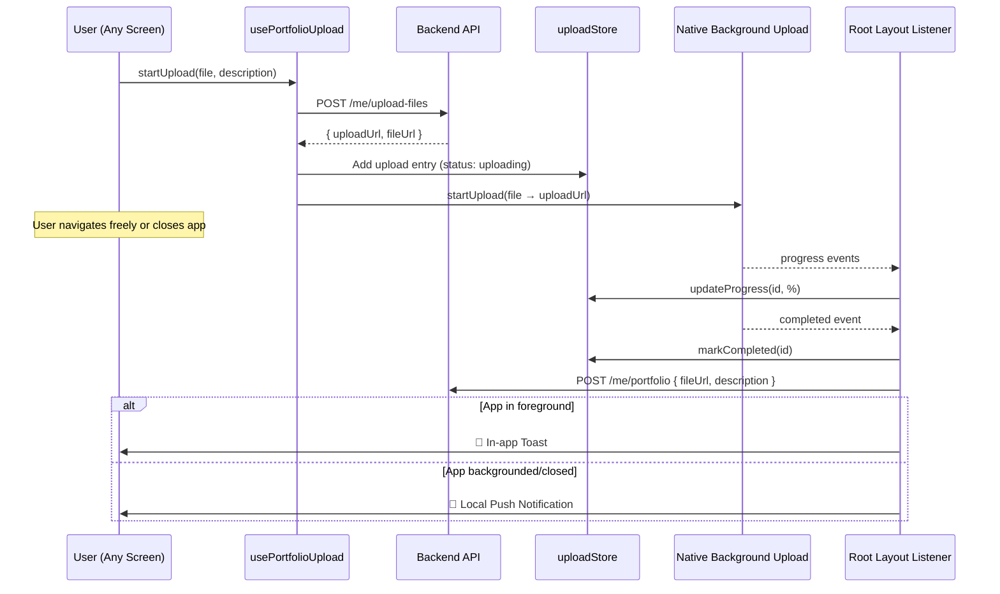

# Portfolio Background Upload System

User picks a file + writes a description → app gets a pre-signed URL → background upload starts → user can navigate freely → on completion, app calls the portfolio API with the `fileUrl` and description → user gets notified.

## User Review Required

> [!IMPORTANT]
> **`react-native-background-upload` requires a dev build** — it's a native module and won't work in Expo Go. Since you're already doing preview builds, this should be fine.

> [!IMPORTANT]
> **Portfolio upload API endpoint**: The plan assumes a `POST /me/portfolio` endpoint exists (or similar) that accepts `{ fileUrl, description, mediaType }`. Please confirm the exact endpoint and payload shape, or I'll add a placeholder mutation you can adjust.

> [!WARNING]
> **Pre-signed URL expiry**: For large video files, ensure the backend issues URLs with a long enough TTL (at least 30-60 min). This is a backend-side config change.

## Proposed Changes

### Upload Store (global state that survives navigation)

#### [NEW] [uploadStore.ts](file:///home/abc/Desktop/Personal/camaroo/store/uploadStore.ts)

A dedicated Zustand store to track portfolio uploads globally:

```typescript
interface PortfolioUpload {
  id: string;              // background-upload ID
  fileUri: string;         // local file path
  fileUrl: string;         // the final S3 URL (from upload API)
  description: string;     // user-entered description
  mediaType: 'image' | 'video';
  contentType: string;
  progress: number;        // 0-100
  status: 'uploading' | 'completed' | 'failed' | 'saving';
  error?: string;
}
```

Actions: `startUpload`, `updateProgress`, `markCompleted`, `markFailed`, `removeUpload`.

---

### Background Upload Service

#### [MODIFY] [upload.ts](file:///home/abc/Desktop/Personal/camaroo/services/upload.ts)

- Keep existing `uploadFileTracked` (used by onboarding profile picture — no change needed there).
- Add a new function `startPortfolioUpload(fileUri, uploadUrl, contentType)` that uses `react-native-background-upload` to start the native upload and returns the `uploadId`.
- Add `setupUploadListeners(uploadId, callbacks)` for progress/complete/error events.

---

### Upload Listener at Root Level

#### [MODIFY] [_layout.tsx](file:///home/abc/Desktop/Personal/camaroo/app/_layout.tsx)

- Add a `usePortfolioUploadListener()` hook call in `RootLayout`.
- This hook subscribes to all active uploads in the store and:
  - On `completed`: calls the portfolio save API (`POST /me/portfolio`), then shows a toast.
  - On `error`: updates store status and shows an error toast.
- This runs at the root level, so it **survives any screen navigation**.

---

### Portfolio Upload Hook

#### [NEW] [usePortfolioUpload.ts](file:///home/abc/Desktop/Personal/camaroo/hooks/usePortfolioUpload.ts)

A hook that any screen can call to kick off a portfolio upload:

```typescript
const { startUpload, activeUpload } = usePortfolioUpload();

// Start: gets pre-signed URL, then kicks off background upload
await startUpload({ fileUri, description, mediaType, contentType });
```

Internally:
1. Calls `getUploadUrlMutation` → gets `uploadUrl` + `fileUrl`
2. Stores the upload intent in `uploadStore`
3. Calls `startPortfolioUpload()` from `upload.ts`
4. Returns immediately — user can navigate away

---

### Portfolio Mutation

#### [MODIFY] [mutations.ts](file:///home/abc/Desktop/Personal/camaroo/services/mutations.ts)

Add a `savePortfolioMutation` function:

```typescript
export const savePortfolioMutation = async (payload: {
  fileUrl: string;
  description: string;
  mediaType: string;
}) => { ... }
```

---

### Notifications (Two-Tier)

#### [NEW] Toast setup (in-app)

- Install `react-native-toast-message` (JS-only, works with Expo)
- Add `<Toast />` component in `_layout.tsx`
- Shows when user is **inside the app** on any screen

#### [NEW] Local push notification (app backgrounded/closed)

- Install `expo-notifications` (already Expo-compatible)
- When the background upload `completed` event fires and app is not in foreground → fire a **local push notification** (no server needed)
- Uses `expo-notifications`'s `scheduleNotificationAsync` with immediate trigger
- On Android: works reliably since `react-native-background-upload` uses a foreground service that keeps JS alive for the callback
- On iOS: `NSURLSession` background uploads complete natively and wake the app briefly to fire the listener → local notification gets scheduled

> [!NOTE]
> These are **local notifications** — no push server (FCM/APNs) setup needed. The app itself fires them when the native upload completes. However, if the OS kills the app entirely before the upload finishes (rare on iOS, possible on Android), the notification won't fire. For that edge case, a backend-triggered push notification (via S3 event → Lambda → FCM) would be needed — but that's a backend change and overkill for now.

---

## Architecture Flow



## Files Summary

| File | Action | Purpose |
|---|---|---|
| `store/uploadStore.ts` | NEW | Global upload state |
| `hooks/usePortfolioUpload.ts` | NEW | Hook to start uploads from any screen |
| `services/upload.ts` | MODIFY | Add background upload function |
| `services/mutations.ts` | MODIFY | Add portfolio save mutation |
| `services/notifications.ts` | NEW | Local push notification helper |
| `app/_layout.tsx` | MODIFY | Root-level upload listener + toast + notification setup |

## Verification Plan

### Manual Verification

Since this involves native background uploads and requires a dev build on a real device/emulator, automated unit tests aren't practical for the core upload flow. Testing plan:

1. **Install dependencies**: Run `npm install react-native-background-upload react-native-toast-message expo-notifications` and rebuild dev client
2. **Trigger upload from a screen**: Call `usePortfolioUpload().startUpload()` with a test file
3. **Navigate away**: Switch to another tab while upload is in progress — verify progress continues (check console logs)
4. **Foreground completion**: Verify toast appears on a different screen when upload finishes
5. **Background completion**: Minimize app during upload → verify local push notification when done
6. **Error case**: Test with an invalid URL to confirm error toast shows
6. **TypeScript check**: Run `npx tsc --noEmit` to verify no type errors

> [!NOTE]
> I'll scaffold all the code but you'll need to do a dev build (`npx expo prebuild && npx expo run:android`) to actually test the native background upload. **Please confirm the portfolio save API endpoint** so I use the correct one.
